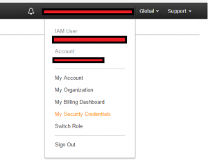
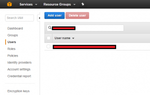
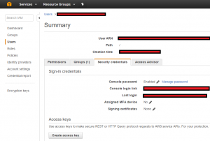
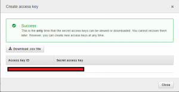

# Setup AWS-Server and Screeps-launcher (with Power-Shell)

## Import the AWS-Power-Shell Module

Original how-to from aws can be found ([here](http://docs.aws.amazon.com/powershell/latest/userguide/pstools-getting-set-up.html#pstools-getting-set-up))

EDIT: The Script is changed to auto-generate the KeyPair, you can Skip 3-6

1. Download AWS-PS-Tools from ([https://aws.amazon.com/de/powershell/](https://aws.amazon.com/de/powershell/))
2. OR: type in `install-Module -Name AWSPowerShell` if u have PS-Gallery configured.
3. Create `AccessKey` and `SecretKey` and note or download em.

- Login to your AWS-Account and go to `MySecurityCredentials`

  

- Search your User

  

- Find `Security Credentials` and than `Create Access Key`

  

- Note (or download CSV-File) your `Access key ID` and `Secret Access Key`

  

4. You have to turn on Script-execution in Powershell. `Set-ExecutionPolicy -ExecutionPolicy RemoteSigned`

5. Now you can Import the Power-Shell Module `import-Module AWSPowerShell`.
6. Create Credentials with `Set-AWSCredentials -AccessKey "AccessKey" -SecretKey "SecretKey" -StoreAs "ProfileName"`. The Profile-name can be chosen free.
7. Depending on Command, you have to set your location. To get Locations you can use `Get-AWSRegion`
8. To Set the Region use `Initialize-AWSDefaults -ProfileName "SAME_NAME_AS_ABOVE" -Region "YOUR-REGION"`
9. Now you can, for example, get All your EC2Instances for that region with `Get-EC2Instance`

## Create new Instance and Network for it

In order to Use this Script u have to activate Ubuntu 20.04 LTS in your Marketplace. ([here](https://aws.amazon.com/marketplace/pp?sku=a8jyynf4hjutohctm41o2z18m))

Run ([.\createServer.ps1](./createServer.ps1)) Script with following Parameters:

- `ProfileName`: The Name of your desired Profile, eg "Screeps"
- `Region`: Your desired Region
- `AvailabilityZone`: The Zone of your selected Region. To get Avail-Zone use: `Get-EC2AvailabilityZone`
- `GroupName`: The Name of your Group, eg "Screeps"
- `KeyName`: The Name of your Key pair.
- `InstanceType`: The Type of the VM-Instance (default is t3.micro which is in the Free-Tier)

Example:

```ps
.\createServer.ps1 -ProfileName "Screeps" -Region: "eu-west-3" -AvailabilityZone "eu-west-3b" -GroupName "Screeps" -KeyName "MyScreepsKey" -InstanceType "t3.micro"
```

After that u can run ([.\Connect-ScreepsVM-afterCreate.ps1](./Connect-ScreepsVM-afterCreate.ps1)) with following Params to Check the Status:

- `ProfileName`: The Name of your desired Profile, eg "Screeps"
- `Region`: Your desired Region

```ps
.\Connect-ScreepsVM-afterCreate.ps1 -ProfileName "Screeps" -Region: "eu-west-3"
```

To get your Public IP use this Command: `(Get-Ec2Instance -InstanceId 99999999999999999 -Region YOUR_REGION).Instances.PublicIpAddress`

## Install Docker

- `sudo apt install apt-transport-https ca-certificates curl software-properties-common`
- `curl -fsSL https://download.docker.com/linux/ubuntu/gpg | sudo apt-key add -`
- `sudo add-apt-repository "deb [arch=amd64] https://download.docker.com/linux/ubuntu focal stable"`
- `sudo apt install docker-ce`
- `sudo usermod -aG docker ${USER}`
- `sudo usermod -aG docker USERNAME`

## Install Docker-Compose

- `sudo curl -L "https://github.com/docker/compose/releases/download/1.27.4/docker-compose-$(uname -s)-$(uname -m)" -o /usr/local/bin/docker-compose`
- `sudo chmod +x /usr/local/bin/docker-compose`
- `cd /opt`
- `sudo git clone https://github.com/Kaimodo/Screeps-launcher-Docker-compose-grafana`
- `cd Screeps-launcher-Docker-compose-grafana`

## Install Screeps-Server

From here you can follow this ([Guid](../ReadMe.md)) to setup the Screeps-part of the Server

### Connect to Server via SSH

`ssh -i myPSKeyPair.pem ec2-user@PublicIpAddress` in the Folder where u executed the Create-Powershell-script(for the key-pair-file).
U can copy and paste the .pem file where ever you want to connect from that folder to your machine.

u can use ([.\Get-AwsIP.ps1](./Get-AwsIP.ps1)) to get your IP, too. Start it like that `.\Get-AwsIP.ps1 -Region "YourRegion"`

## Delete machine (WIP as of 01.12.2021)

THE DELETE Script is WIP and throws some errors. It works partially.

to delete u can use the script ([deleteServer.ps1](/aws/deleteServer.ps1)) with those parameters:

- `ProfileName`: The Name of your desired Profile, eg "Screeps"
- `Region`: Your desired Region
- `KeyName`: The Name of your Key pair.
- `GroupName`: The Name of your Group, eg "Screeps"

Example:

```ps
.\deleteServer.ps1 -ProfileName "Screeps" -Region: "eu-west-3" -KeyName "MyScreepsKey" -GroupName "Screeps"
```
